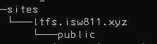

# Workshop 2

## Levantar la VM

1. Vamos a la ruta de /vms
2. Ejecutamos el comando `vagrant up`

---

## Agregar rutas DNS

1. En la ruta `c/windpows/system32/drivers/etc/hosts` editamos el archivo `hosts`
2. Agregamos las siguientes entradas

   - 192.168.33.10 webserver
   - 192.168.33.10 mibanco.com
   - 192.168.33.10 lfts.isw811.xyz

3. Despues hacemos Ping a los dominios

   - ping webserver
   - ping mibanco.com
   - ping lfts.isw811.xyz

4. Los pings deben ser exitosos a todos los dominios

---

## Cambiar nombre de la maquina

### En la maquina Virtual

`sudo hostnamect set-hostname webserver`

Instalar paquetes LAMP Vim cURL, APache2, MySQL y PHP

1. Actualizar paquetes
2. `sudo apt `

3. `sudo apt-get install vim vim-nox curl git apache2 mariadb-server mariadb-client php7.4 php7.4-bcmath php7.4-curl php7.4-json php7.4-mbstring php7.4-mysql php7.4-xml `

---

## Crear el VHOS para el sitio LFTS

### En la maquina Anfitriona

1. En la maquina anfitriona en la carpeta de la VM `touch ltfs.isw811.xyz.conf`
2. En este archivo ponemos el siguiente codigo en el archivo `vhosts`

   - [VHOSTS](vhost.md)

3. Creamos la siguiente estrucutra de directorios

   - 

4. Modificamos el Vagranfile para sincronizar las carpetas de sites

`config.vm.synced_folder "sites/", "/home/vagrant/sites", owner: "www-data", group: "www-data"`

### En la maquina Virtual

1. En la maquina virtual ir a la carpeta `/vagrant`
2. Ahi creamos carpeta
3. Copiamos el sitio a los sitios de apache `vagrant@127.0.0.1: Permission denied (publickey).`
4. Editamos el archivo hosts `sudo nano /etc/hosts`
5. Cambiar bullseye a webserver
6. Copiar el sitio local al sitio apache `sudo cp vagrant/lfts.isw811.xyz.conf /etc/apache2/sites-available/`
7. Ejecutar el comando `sudo a2enmod vhost_alias rewrite ssl`
8. Editar la configuracion de apache `sudo nano /etc/apache2/apache2.conf`

   `ServerName 127.0.0.2`

9. Validar la configuracion `sudo apache2ctl -t`
10. Levantar el sitio `sudo a2ensite lfts.isw811.xyz.conf`
11. Reiniciar apache `sudo systemctl reload apache2.service`
12.
